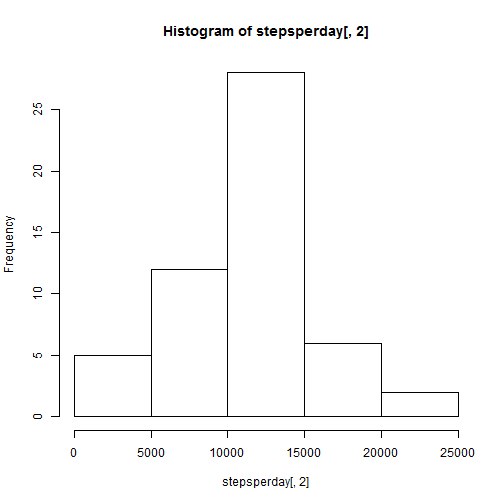
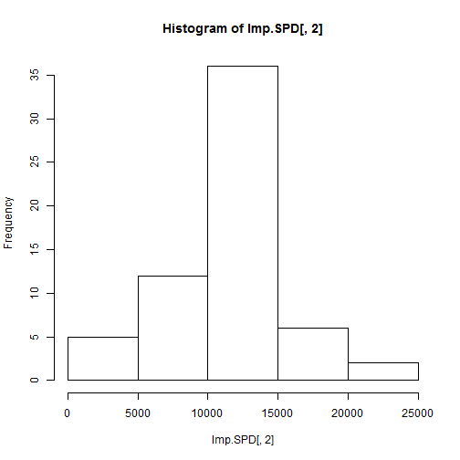
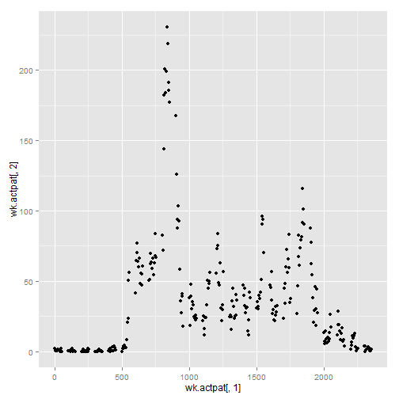
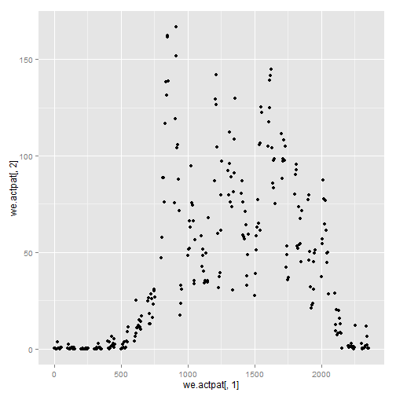

## Loading and preprocessing the data

```r
activity <- read.csv("C:/Coursera/5-RR/Assignment/activity.csv")
gd.activity<-activity[complete.cases(activity),]
```
## What is mean total number of steps taken per day?

```r
###Steps Per Day
stepsperday<-aggregate(gd.activity$steps, by = list(gd.activity$date), sum)
###Histogram
hist(stepsperday[,2])
```

 

```r
###Mean Per Day
meanperday<-aggregate(gd.activity$steps, by = list(gd.activity$date), mean)
###Median Per Day
medianperday<-aggregate(gd.activity$steps, by = list(gd.activity$date), median)
```

## What is the average daily activity pattern?

```r
###average daily activity pattern
actpat<-aggregate(gd.activity$steps, by = list(gd.activity$interval), mean)
### 5-minute interval (x-axis) and the average number of steps taken, averaged across ###all days (y-axis)
qplot(actpat[,1],actpat[,2])
```

 

```r
###5-minute interval, on average across all the days in the dataset, contains the ###maximum number of steps
actpat[which.max(actpat[,2]),]
```

```
##     Group.1        x
## 104     835 206.1698
```


## Imputing missing values

```r
summary(activity)
```

```
##      steps                date          interval     
##  Min.   :  0.00   2012-10-01:  288   Min.   :   0.0  
##  1st Qu.:  0.00   2012-10-02:  288   1st Qu.: 588.8  
##  Median :  0.00   2012-10-03:  288   Median :1177.5  
##  Mean   : 37.38   2012-10-04:  288   Mean   :1177.5  
##  3rd Qu.: 12.00   2012-10-05:  288   3rd Qu.:1766.2  
##  Max.   :806.00   2012-10-06:  288   Max.   :2355.0  
##  NA's   :2304     (Other)   :15840
```

```r
Imp.activity<-merge(activity, actpat, by.x = "interval", by.y = "Group.1", all=TRUE)
Imp.activity$clnsteps<-Imp.activity$steps
for (i in 1:nrow(Imp.activity))
{
        if (is.na(Imp.activity$clnsteps[i]))
        {        
                Imp.activity$clnsteps[i]<-Imp.activity$x[i]
            
        }
}
### Imputed Data - Steps Per Day
Imp.SPD<-aggregate(Imp.activity$clnsteps, by = list(Imp.activity$date), sum)
###Imputed Data Histogram
hist(Imp.SPD[,2])
```

 

```r
### Imputed Data - Mean Per Day
Imp.MPD<-aggregate(Imp.activity$clnsteps, by = list(Imp.activity$date), mean)
###Imputed Data - Median Per Day
Imp.MePD<-aggregate(Imp.activity$steps, by = list(Imp.activity$date), median)
```


## Are there differences in activity patterns between weekdays and weekends?

```r
Imp.activity$weekdays<-weekdays(as.Date(Imp.activity$date,"%Y-%m-%d"))
weekdays<-c("Monday","Tuesday","Wednesday","Thursday","Friday","Saturday","Sunday")
weekind<-c("Weekday","Weekday","Weekday","Weekday","Weekday","Weekend","Weekend")
weekinfo<-cbind(weekdays,weekind)
Wk.activity<-merge(Imp.activity, weekinfo, by.x = "weekdays", by.y = "weekdays", all=TRUE)

weekdays.activity <- Wk.activity[ which(Wk.activity$weekind=='Weekday'), ]
weekend.activity <- Wk.activity[ which(Wk.activity$weekind=='Weekend'), ]

###average Week daily activity pattern
wk.actpat<-aggregate(weekdays.activity$clnsteps, by = list(weekdays.activity$interval), mean)


###average Weekend daily activity pattern
we.actpat<-aggregate(weekend.activity$clnsteps, by = list(weekend.activity$interval), mean)

### 5-minute interval (x-axis) and the Week average number of steps taken, averaged across ###all days (y-axis)
### 5-minute interval (x-axis) and the Weekend average number of steps taken, averaged across ###all days (y-axis)

par(mfrow=c(2,1))
qplot(wk.actpat[,1],wk.actpat[,2])
```

 

```r
qplot(we.actpat[,1],we.actpat[,2])
```

 
